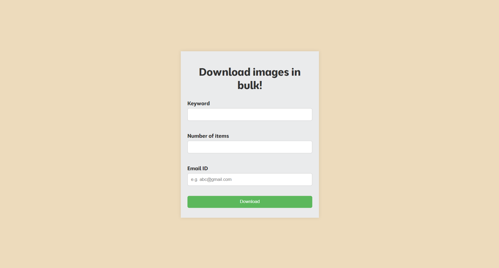

# Image-downloader
This project helps the user to download limited and word specific images from the internet in bulk. The result would be mailed to email-ID in a RAR file.



To run the web app,
```
python app.py
```
Then enter the details according to your preference in the form shown above.

## Technologies/Frameworks
- Python
- HTML, CSS, JavaScript
- Flask
- google_images_search
- yagmail

<b>Please note that Google Custom Search API has a daily limit on the number of requests you can make, so use judiciously.</b>
